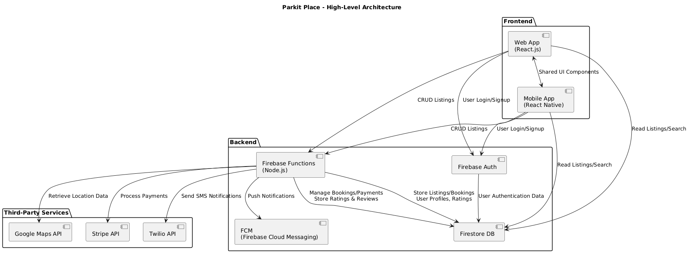

## COMPSCI-4ZP6A-Capstone-Project-2024

### Rough Idea of Project Architecture



### Initializing Packages
in repsepctive folder example: /backend run:
```
npm i
npm -g install firebase-tools
```

### Firebase Commands
log in in to servless provider run:
```
firebase login
firebase emulators:start
```

### Main -> Master branch name change commands
```
git branch -m main master
git fetch origin
git branch -u origin/master master
git remote set-head origin --a
```
